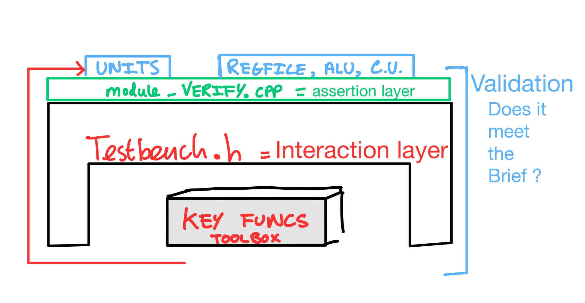
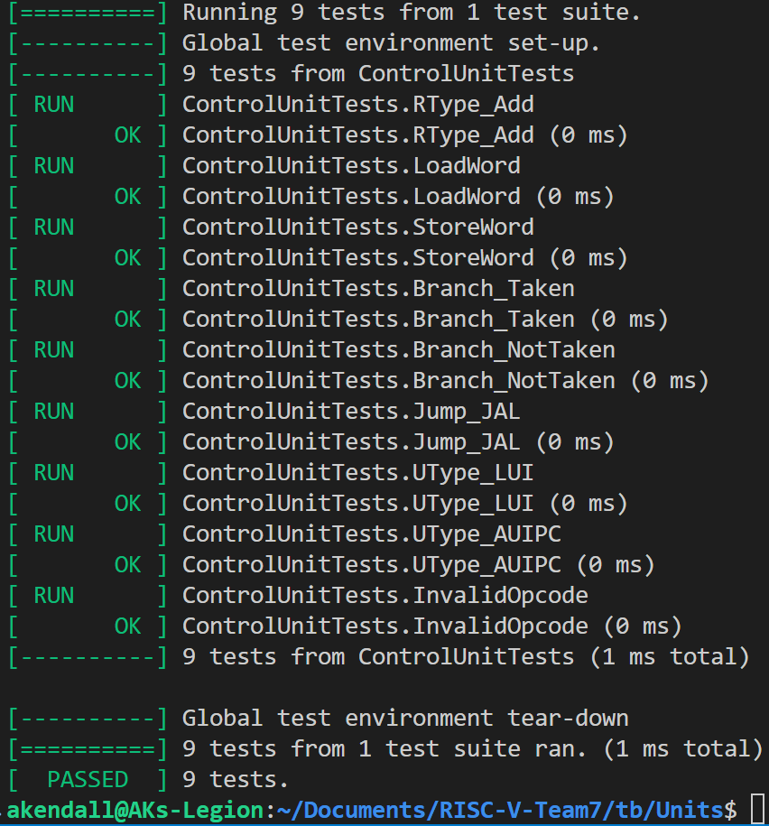
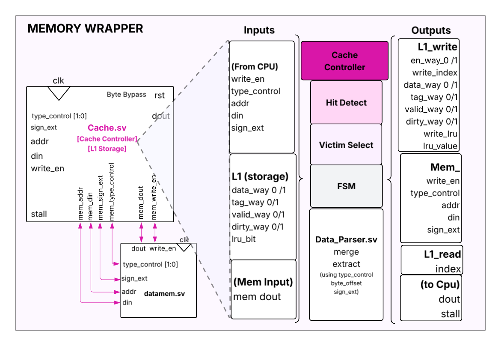
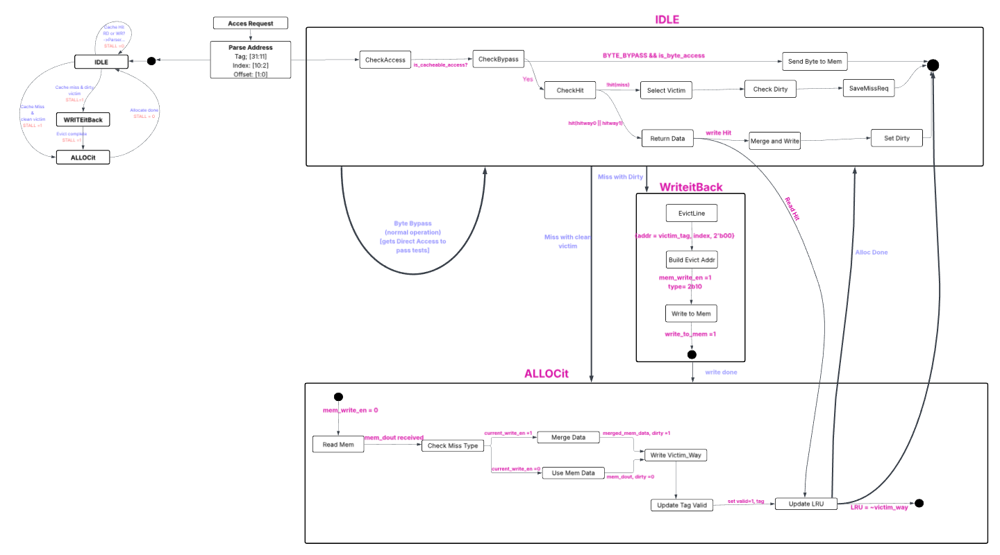

# Contents
#### Contributions

1. [Fundamental Unit Testing](#fundamental-unit-testing---test-and-verification-of-single-cycle-components)
   - [Template-based Testbench Framework](#commit-group-testbench-foundations)
   - [Module Verification & Memory Correctness](#commit-group-module-test---my-key-contributions)

2. [Pipelining](#pipelining)
   - [F/D/E/M/W Stage Architecture](#pipelining)
   - [Vbuddy Test Suite with Build Phase Detection](#pipelining)

3. [Cache - Single Cycle Exploration](#cache---single-cycle-exploration)
   - [2-Way Set Associative with BRAM](#architecture)
   - [4-State FSM with Gated Clock](#fsm-pseudocode)

4. [L1 Cache - Pipelined](#l1-cache---pipelined)
   - [3-State FSM & LRU Replacement](#finite-state-machine-fsm)
   - [Cache Testing, Stall Handling & Performance Metrics](#cache-stall-handling-and-hazard-unit-integration)

5. [Prefetch Attempt](#prefetch-attempt-in)
   - [Zero-Penalty Sequential Prefetch](#state-machine-extension)
   - [Conditional Prefetch Logic](#conditional-prefetch-logic)

---

### Fundamental Unit Testing - Test and Verification of Single Cycle Components

During the Single-Cycle stage of the project, I did most of the initial component verification, I agreed with all members to develop a two-layer modular testing framework to enable rapid, reliable prototyping. Working in the **verification branch**, the framework consisted of reusable testbench base classes (```clocked_testbench.h ``` and ```comb_testbench.h```) for the interaction layer, integrated with Google Test assertions in module-specific ``*``_verify.cpp``` files for the validation layer. **All our Unit tests now in ./tb/Units folder**



| Module | Testbench (.h) | Tests (.cpp) | Tests Passed |
|--------|----------------|--------------|--------------|
| ALU | ✓ | ✓ | ✓ |
| Control Unit | ✓ | ✓ | ✓ |
| Data Memory | ✓ | ✓ | ✓ |
| Register File | ✓ | ✓ | ✓ |
| Sign Extend | ✓ | ✓ | ✓ |
| Template | ✓ | ✓ | - |
| **Base Classes** | clocked_testbench.h<br>comb_testbench.h | | - |
| **Build/Docs** | doitunit.sh| | - |

*Test Setup - Visualised*

Note: A lot of our naming conventions append 'it' to scripts to make terminal commands easier to remember.



*Control unit example unit test passing*

All other modules passed their required tests I wrote, including most prominently : ```regfile, signextend, control unit, alu, datamem```

Utilising automatic RTL Discovery across nested directories looking for the module's verify script and testbench for example:

```bash
RTL_SOURCE=$(find ../../rtl -maxdepth 3 -type f -name "${MODULE}.sv" | head -n 1)
```

**Template-based Testbench Reusability (clocked_testbench.h):**
```cpp
template<class Module>
class ClockedTestbench : public ::testing::Test {
    // Single base class supports all clocked modules
}
```

**Dynamic Per-Test Waveform Naming (automatic debugging):**
```cpp
std::string vcd_name = "waveform_" + std::string(MODULE_NAME) + "_" + test_name + ".vcd";
```

This allowed GTKWave debugging much easier - to debug the memory allocation issues we faced - and gave me a holistic look into the full CPU architecture. 


----

#### **Commit Group: Testbench Foundations**
(I lead the whole Units Folder) - Some examples:

| Date | Commit | Description | Impact |
|------|--------|-------------|--------|
| Nov-21 | **550e02a** | Generic unit testing build script (`doitunit.sh`) | Automated testing |
| Nov-21 | **07a731e** | Added `ClockedTestbench` base class | Sequential testing |
| Nov-21 | **7977220** | Generic template testing files | Rapid test creation |

I continued to build testbenches (.h) functions and test modules custom - module_verify.cpp as the team produced their relevant components. I made some key changes due to this; these tests prevented numerous integration failures later - this required constant communication and collaboration with **Adil**, **Louis** and **Sam**. Some issues and changes we faced:

#### **Commit Group: Module Test** - My Key Contributions
(Many commits since merged - may be hard to discover)
| Commit | Module | Summary |
|--------|---------|---------|
| **ef7a1d4** | ALU | Full operation & flag verification |
| **15a0468** | Register File | Detected reset/x0 bug (critical) |
| **730611f** | Control Unit | Updated + expanded tests |
| **af585ca** | Sign Extend | Testbench for extender behaviour |
| **fed1846** | Data Memory | Added data memory testing |

#### **Commit Group: Memory Correctness**
The brief issued a deisgnated memory map, making memory allocation and mangement vital leading to some more key contributions

| Commit | Description | Impact |
|--------|-------------|--------|
| **e77191a** | Memory-map bounds checking | Prevent illegal access |
| **a1196b7** | Byte alignment handling | Avoid misaligned loads/stores |
| **bc6787d** | Correct InstrMem + byte addressing | Architectural correctness |


# **Pipelining**

**Adil** and myself designed independent stages (F/D/E/M/W) to increase clarity and testability for our pipelined CPU - **a7c8ba7**.
This led to me designing key Vbuddy tests  with hotswap bash scripts, all run from ```/tb/vbuddy_tests folder```.
- ```1./f1.sh``` for the F1 test
- hotswap `./pdf.sh <distribution>` e.g. ```./pdf gaussian```

Most notably adding **build phase detection** to the pdf testbench, and **downsampling** to prevent overwhelming the display.

```cpp

#define PLOT_SAMPLE_RATE 5 // eg sample_idx % PLOT_SAMPLE_RATE==0 -> Plot
// Capture idle value of a0 at start
int idle_a0 = top->a0;
bool plot_trigger = false;

// Monitor a0 for changes from idle state
// Only enable plotting when a0 changes, indicating build phase finished
if (!plot_trigger && top->a0 != idle_a0) {
    plot_trigger = true;  // PDF program now actively running
    vbdHeader("PDF: Running");
}
```


*example: vbuddy displaying pdf plot due to testbenching*


As stages were built up, I continued to test and integrate the main CPU to ensure we could pass all the tests required in the brief, previous tests had to be revised as our CPU became more complex through Pipelining, again working closely with Sam on this.


# Cache - Single Cycle Exploration
**in Cache-noPPL branch**

While the team focused on pipelining, I proactively explored cache implementation to ensure adequate development time before the deadline. This proved architecturally challenging, as our single-cycle CPU relied on an idealised combinational main memory with near-zero latency - a design assumption that makes realistic memory architectures hard. 

To bridge this gap, I investigated BRAM (Block RAM) primitives for potential FPGA synthesis targets, replacing our original LUT-based data memory. This exploration involved extensive debugging of cache coherence protocols, implementing read/write data formatters, and designing a proper FSM-based controller, many approaches led to architectural dead ends before achieving a functional prototype, which still failed many key tests.

#### Architecture: 
**Configuration:**
- **Capacity:** 16-byte cache lines (4 words × 32 bits)
- **Associativity:** 2-way set associative
- **Replacement:** LRU (1-bit per set)
- **Write Policy:** Write-back with dirty bit tracking

**BRAM Storage Structure** (303-bit entries, synchronous write / asynchronous read):
```
[302]       = LRU bit (1 bit)
[301:151]   = Way 1: [Valid(1) | Dirty(1) | Tag(21) | Data(128)]
[150:0]     = Way 0: [Valid(1) | Dirty(1) | Tag(21) | Data(128)]
```

The cache controller utilized a 4-state FSM with 4-word burst transfers to exploit spatial locality, coordinated by read/write data formatters for sub-word access alignment.

#### FSM Pseudocode:
```
STATE IDLE:
    If CPU request:
        If hit:
            If write: update line, set dirty
            Update LRU
        Else (miss):
            Stall CPU
            Latch request
            If victim dirty → WRITEBACK
            Else → ALLOCATE

STATE WRITEBACK:
    Stall CPU
    Write victim line to memory (4-word burst)
    → ALLOCATE

STATE ALLOCATE:
    Stall CPU
    Read new cache line from memory (4-word burst)
    Merge CPU write if needed
    → UPDATE_SRAM

STATE UPDATE_SRAM:
    Write new line into cache
    Set valid/dirty, update LRU
    → IDLE
```

It would pass my simple cache asm tests.
Our CPU struggled to handle complex sub-word cache line replacement e.g. byte stores and loads, especially repeatedly to the same address - something the PDF in particular strains heavily.

The controller attempted to use a 2-bit counter (burst_cnt) that increments each cycle to generate sequential addresses and select which of the 4 words (0→1→2→3) to write/read during WRITEBACK/ALLOCATE states.

Overcoming unpipelined using gated clock for fetch/decode/execute stages and using full clock for Memory stage:
```systemverilog
logic cpu_clk;
assign cpu_clk = clk && !stall;  // freeze these stages during cache miss
```

**Learning Outcomes:** Reduce cache line size for actual pipelined CPU, use a simple FSM instead, stick with LRU and build up from combinational implementation, although stalls would have to be handled correctly by our future hazard unit. 


# L1 Cache - Pipelined
#### Writeback, LRU Replacement, FSM
*(In cache-final branch)*

After the team had finished fundamental pipelining, I looked to build a correct and scalable cache to build into our CPU. I built a new memory wrapper that could be easily integrated with our CPU when ready and easily upgraded to include L2 cache when needed.



*Memory wrapper diagram*


---

## Module Architecture

I implemented a modular cache system with three primary components:

- **cache_controller.sv** - FSM-based controller managing cache operations
- **cache_L1.sv** - Dual-way storage array with tag, data, valid, dirty, and LRU bits
- **cache_data_parser.sv** - Byte/halfword/word access handler and data merger

and full cache testing suite with hit/miss tracking as well as unit ```asm.``` tests for targeting word, halfword and byte operations and evictions in the ```cache_testing folder```
I debugged myself, with key input at regular meetings often involving **Louis** and **Adil**'s input on how they could help and implement with their modules or update their code to help cache implementation.

---
#### Architecture: 
**Configuration:**
- **Capacity:** 4 byte cache lines (32 bits)
- **Associativity:** 2 way set associative
- **Replacement:** LRU (1 bit per set)
- **Write Policy:** Writeback with dirty bit tracking
**We parse the address as: TAG: [31:11] | INDEX [10:2] | OFFSET [1:0]**


#### Key Implementation Features

### Finite State Machine (FSM)

**Feature:** I designed a 3-state FSM to manage cache miss handling:

```systemverilog
typedef enum logic [1:0] {
    IDLE, WRITEitBack, ALLOCit
} cache_state_t;
```




*Full state machine diagram I designed with some key variable names - may need expanding to view*

**Debug Issue:** Initially, stall signals were generated one cycle late, causing pipeline corruption. I fixed this by asserting stall immediately on miss detection in the IDLE state, not waiting for state transition. I also introduced BYTE ACCESS to set is_cacheable_access - to ensure we could pass PDF test even if cache failed to handle byte manipulation. ie. capable of bypassing cache fully if not set to help debug.

**Complete FSM Code:**
```systemverilog
always_comb begin
    next_state = state;
    stall = 1'b0;

    case (state)
        IDLE: begin
            if (is_cacheable_access && !hit) begin
                stall = 1'b1;  // Assert immediately on miss detection
                if (evict_dirty) begin
                    next_state = WRITEitBack;  // Dirty victim needs writeback
                end else begin
                    next_state = ALLOCit;      // Clean miss, allocate directly
                end
            end
        end

        WRITEitBack: begin
            next_state = ALLOCit;
            stall = 1'b1;  // Hold stall during writeback
        end

        ALLOCit: begin
            next_state = IDLE;
            stall = 1'b1;  // Hold stall during allocation
        end

        default: next_state = IDLE;
    endcase
end

always_ff @(posedge clk) begin
    if (rst)
        state <= IDLE;
    else
        state <= next_state;
end
```
---

### LRU Replacement Policy

**Feature:** I implemented LRU policy using a single bit per set. On every cache hit, the LRU bit updates to point to the opposite way (the way that was just accessed becomes MRU, so LRU points to the other way):

**Debug Issue:** LRU bits weren't updating on read hits, only write hits. This caused incorrect victim selection in eviction_test.s (evicted A instead of B).

**Complete LRU Update Logic:**
```systemverilog
// LRU update on write hits
if (is_cacheable_access && current_write_en && state == IDLE) begin
    if (hit_way0) begin
        L1_write_en_way0 = 1'b1;
        L1_write_data_way0 = merged_cache_data;
        L1_write_dirty_way0 = 1'b1;
        L1_write_lru = 1'b1;
        L1_lru_value = 1'b1;  // Way1 now LRU (way0 was just accessed)
    end else if (hit_way1) begin
        L1_write_en_way1 = 1'b1;
        L1_write_data_way1 = merged_cache_data;
        L1_write_dirty_way1 = 1'b1;
        L1_write_lru = 1'b1;
        L1_lru_value = 1'b0;  // Way0 now LRU (way1 was just accessed)
    end
end
// LRU update on read hits (critical fix!)
else if (is_cacheable_access && !current_write_en && state == IDLE) begin
    if (hit_way0) begin
        L1_write_lru = 1'b1;
        L1_lru_value = 1'b1;  // Way1 now LRU
    end else if (hit_way1) begin
        L1_write_lru = 1'b1;
        L1_lru_value = 1'b0;  // Way0 now LRU
    end
end
// LRU update on allocation (mark allocated way as MRU)
else if (is_cacheable_access && state == ALLOCit) begin
    L1_write_lru = 1'b1;
    L1_lru_value = ~victim_way;  // Make the other way LRU
end
```

**Outcome:** eviction_test.s now passes with correct victim eviction patterns.

---

### WriteBack Policy with Dirty Bits

**Feature:** I implemented writeback caching where modified cache lines are marked dirty and only written to memory on eviction:

```systemverilog
WRITEitBack: begin
    write_addr = {victim_tag, index, 2'b00};
    write_data = victim_data;
end
```

**Debug Issue:** Write misses were allocating clean lines instead of dirty ones. The merged write data wasn't being applied during allocation, and dirty bit stayed 0. This caused written values to be lost after eviction in word_complex.s.

**Code Fix:**
```systemverilog
L1_write_data_way0 = current_write_en ? merged_mem_data : mem_dout;
L1_write_dirty_way0 = current_write_en ? 1'b1 : 1'b0;
```
---

### Byte/Halfword/Word Access Support

**Feature:** I implemented sub-word access through a data parser module that merges partial writes with existing cache line data. The cache receives ```type_control[1:0]``` and ```sign_ext``` signals from the control unit to handle sub-word memory operations, where type_control specifies the access size (byte, halfword, or word) and sign_ext determines whether to sign-extend or zero-extend the loaded data. These control signals enable the cache to properly extract and format data from 32-bit cache lines on cache hits, or pass them through to main memory on cache misses. 

```systemverilog
merged_data = base_data;
case (byte_offset)
    2'b00: merged_data[7:0] = write_data[7:0];
```
*code extract*
**Debug Issue:** Byte operations corrupted cache lines in byte_complex.s because merged_data wasn't initialized with base_data. Storing 0x12 at byte 0, then 0x34 at byte 1, but reading byte 0 gave 0x34. I tried overocmming by ensuring the base data is read first and verifying it's source - but it continues to struggle with these manipulations and needs further debugging.

---

### Victim Selection Logic

**Feature:** I prioritized filling invalid ways before using LRU for eviction:

```systemverilog
if (!L1_valid_way0) victim_way = 1'b0;
else if (!L1_valid_way1) victim_way = 1'b1;
else victim_way = L1_lru_bit;
```

**Debug Issue:** Initially had inverted logic, selected way1 when way0 was invalid. This caused the second access to a set to evict the first entry instead of filling the empty way1.

---

### Hit Detection and Address Parsing

**Feature:** I implemented tag comparison for both ways with proper address decomposition:

```systemverilog
assign tag = current_addr[ADDR_WIDTH-1:INDEX_BITS+2];
assign index = current_addr[INDEX_BITS+1:2];
assign hit_way0 = L1_valid_way0 && (L1_tag_way0 == tag);
```

**Debug Issue:** Writeback address was missing the 2-bit byte offset, resulting in mem_addr = 0x00010004 instead of 0x00010000 during WRITEitBack state.

**Code Fix:**
```systemverilog
write_addr = {victim_tag, index, 2'b00};
```
**Outcome:** Eviction test passes with correct writeback addresses confirmed in GTKWave.

---

#### Cache Stall Handling and Hazard Unit Integration

A critical challenge in implementing cache for our pipelined CPU was managing **cache stalls** - multi-cycle delays when cache misses occur. I designed a comprehensive stall propagation system that coordinates between the cache controller and hazard unit to freeze the pipeline correctly without losing data or corrupting state.

##### Cache Stall Signal Generation

The cache controller generates the `stall` signal using a 3-state FSM:

**Key Design Decision:** The stall signal is asserted **combinationally in the IDLE state** the moment a miss is detected. This prevents the pipeline from advancing before the miss is handled, avoiding pipeline corruption.

#### Hazard Unit Response to Cache Stalls

The hazard unit receives the `cache_stall` signal and implements a **pipeline drainage strategy**:

```systemverilog
if (cache_stall) begin
    PC_en  = 1'b0;  // Freeze Program Counter
    F_D_en = 1'b0;  // Freeze Fetch→Decode register
    D_E_en = 1'b0;  // Freeze Decode→Execute register
    E_M_en = 1'b1;  // Allow Execute→Memory to drain
    M_W_en = 1'b1;  // Allow Memory→Writeback to drain
    no_op  = 1'b1;  // Insert bubble in Execute stage
end
```
Integrated with hazard unit 
```systemverilog
assign reg_en = ~(A_L_haz | cache_stall);
```

**Strategy Rationale:**
- **Freeze front-end** (PC, F_D, D_E): Prevents new instructions from entering the pipeline while a memory operation is stalled
- **Drain back-end** (E_M, M_W enabled): Allows the stalled instruction in the Memory stage to eventually complete once the cache resolves the miss
- **Insert NO-OP**: Creates a pipeline bubble in the Execute stage to prevent invalid operations during the stall

I tried to ensure that:
- No instruction is lost during stalls
- The stalled memory instruction eventually completes
- Later pipeline stages can continue retiring completed instructions
- The pipeline resumes cleanly after stall resolution

*This is a key point of error and further debugging required as different strategies could be used like selective stage freezing based on miss source.*


#### Debug: Immediate Stall Assertion

**Original Issue:** Initially, the stall signal was generated one cycle late because it waited for the FSM state transition. This caused the pipeline to advance one instruction before freezing, leading to incorrect PC values and data corruption.

**Solution:** I modified the stall logic to assert **combinationally** in the IDLE state when a miss is detected, before the state transition occurs. This ensures the hazard unit sees the stall in the same cycle as the miss detection.

### Performance Metrics Implementation

**Feature:** I implemented hit/miss counters in the testbench to track cache effectiveness.

**Code Fix:**
```cpp
if (mem_operation && !rst && !program_finished){
    if (!current_stall && !prev_stall){
        cache_hits++;  // Added hit counting
        total_cache_accesses++;
    }
}
```
Formulas implemented in cache_testing folder:
```
hit_rate = (cache_hits / total_cache_accesses) × 100%
miss_rate = (cache_misses / total_cache_accesses) × 100%
```
```cpp
AMAT = t_hit + (miss_rate × t_miss) + dirty_eviction_penalty
```
#### Stall Duration and Performance Impact

Cache misses incur different stall penalties depending on whether a dirty eviction is required:

- **Clean miss (no writeback)**: 1 cycle stall (IDLE→ALLOCit→IDLE)
- **Dirty miss (requires writeback)**: 2 cycle stall (IDLE→WRITEitBack→ALLOCit→IDLE)

The performance metrics I implemented in [verify_cache.cpp] rack the impact of these stalls:

Where:
- `t_hit = 1 cycle` (combinational cache access)
- `t_miss = 1-2 cycles` (depending on dirty bit)
- `dirty_eviction_penalty` tracks additional writeback overhead


This ensures that **cache stalls override** normal pipeline operation, and the pipeline remains frozen until the cache controller clears the stall signal.

The Full testbench can be run from tb folder using ```./cacheit.sh.```
For example, the eviction test giving:


*Cache within CPU*
---

## Prefetch Attempt
**in prefetch-attempt Branch**

Although the cache hadn't been fully debugged, I was fascinated with optimization techniques as I had already tried to stretch myself in single cycle with 4-word burst to utilize better spatial locality also. So I added prefetch infrastructure on a separate branch for our pipelined version.

The prefetch mechanism also operates on the principle of spatial locality. When a cache miss occurs, after fetching the requested cache line, the controller proactively fetches the next sequential cache line before the CPU requests it.

### State Machine Extension

I extended the state machine to include a `PREFETCHit` state, calculating the next sequential line by adding 4 bytes (one word) to the missed address:

```systemverilog
assign prefetch_addr = miss_addr + 4;
assign prefetch_tag = prefetch_addr[ADDR_WIDTH-1:INDEX_BITS+2];
assign prefetch_index = prefetch_addr[INDEX_BITS+1:2];
```

### Conditional Prefetch Logic

I also had to add conditional prefetch logic with a muxed address path

```systemverilog
ALLOCit: begin
    if (!prefetch_hit && !prefetch_evict_dirty) begin
        next_state = PREFETCHit;
        prefetch_needed = 1'b1;
    end else begin
        next_state = IDLE;
    end
end
```

Prefetch happens during the allocation stall cycle, so it adds zero extra stall penalty to the CPU.

### Debugging Challenges

Debugging was made hard due to state-dependent address muxing, dual victim selection, cache line ambiguity as the cache line was currently one word, and timing issues on GTKWave with prefetching reading while state is being modified.

For example, the **dual victim selection** issue:

**Issue:** Separate victim selection for normal misses AND prefetch, doubling the potential failure points.

```systemverilog
// Normal victim selection
if (!L1_valid_way0) victim_way = 1'b0;
else if (!L1_valid_way1) victim_way = 1'b1;
else victim_way = L1_lru_bit;

// Prefetch victim selection (duplicate logic)
if (!L1_valid_way0) prefetch_victim_way = 1'b0;
else if (!L1_valid_way1) prefetch_victim_way = 1'b1;
else prefetch_victim_way = L1_lru_bit;
```

- If there's a bug in victim selection (like the inverted logic bug encountered), there are now TWO places it can fail
- Prefetch might evict the wrong way, but since it's speculative, the bug only manifests later
- GTKWave sometimes showed both `victim_way` and `prefetch_victim_way` - and I couldn't figure out which one caused the bad eviction?

This still needs to be debugged along with the cache, but could still be integrated into our CPU. 

---

### Future Plans

Given more time, I'm eager to pursue several extensions across four key areas:

**Immediate Priorities:**
- Debug remaining cache coherence issues
- Complete prefetch implementation
- Explore true LRU replacement policies

**Architectural Enhancements:**
- Two-level adaptive branch prediction with BTB
- L2 unified cache with coherence protocols
- Out-of-order execution with Tomasulo's algorithm

**Hardware Synthesis:**
- Full FPGA implementation leveraging my BRAM exploration
- Timing closure and resource optimization

**Formal Methods:**
- Property-based verification of cache invariants
- Model checking for hazard correctness

---

### Teamwork and Collaboration

**Communication & Workflow:**

We communicated through daily WhatsApp standups and weekly in-person sessions, using Git feature branches for parallel development. When disagreements arose, we resolved them through data-driven discussion and thorough testing. The steep learning curve required mutual support, sharing debugging techniques, pairing on Vbuddy tests, and normalising asking for help when hitting architectural dead ends.

**Key Lessons:**
- Modular interfaces enabled parallel work
- Comprehensive testing built confidence
- Intertwined collaboration allowed rapid prototyping

I look forward to working with the same team members in the future.

**Many thanks to Louis, Adil and Sam.**


---


---
